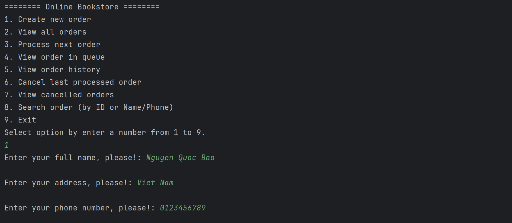
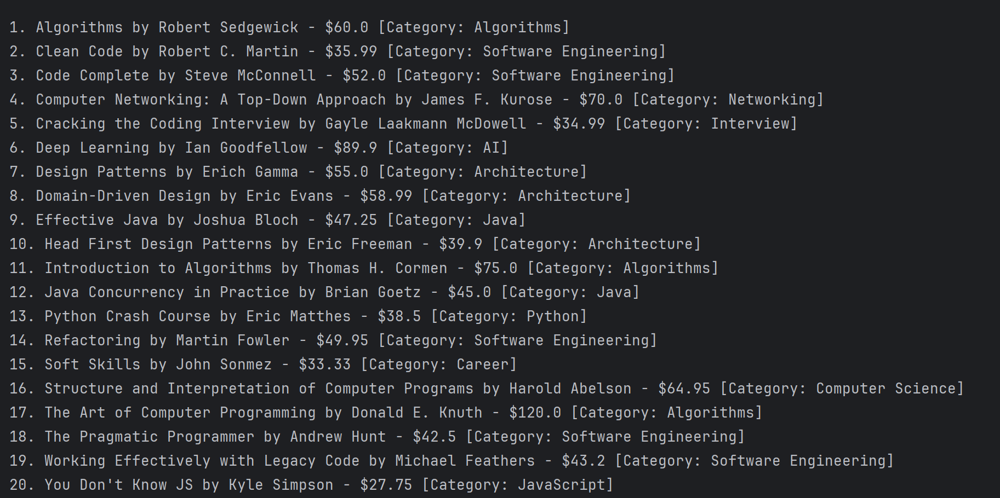
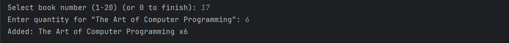
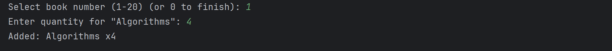
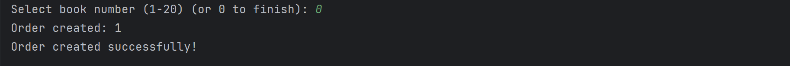
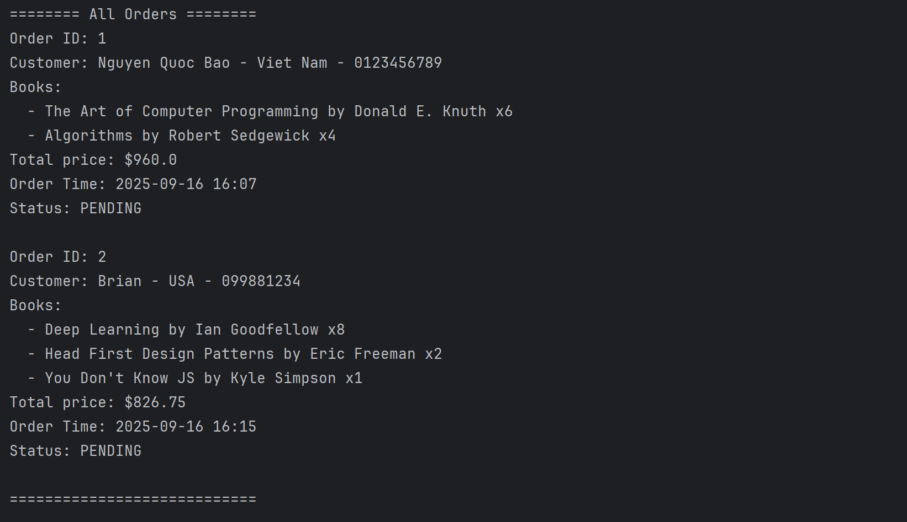

# Online Bookstore CLI Application

This Java mini project simulates an online bookstore with a command-line interface (CLI), designed to practice **OOP (Object-Oriented Programming)** principles and working with **DSA**. It includes core functionalities such as browsing books, placing and processing orders in a queue, as well as searching and sorting orders directly from the terminal.
## 🎯 Learning Objectives

This mini project was developed as part of a coursework assignment with the goal of practicing:

- **Object-Oriented Programming (OOP)** concepts (classes, objects, encapsulation, modular design)  
- **Data structures** such as `ArrayList` (for managing books) and `Queue` (for handling orders)  
- **Algorithms** including `Insertion Sort` (for sorting orders/books) and `Binary Search` (for efficient searching) 
- **Console-based interaction** via a simple text-based menu system  
- **Problem-solving and software design** through implementing real-world bookstore operations  
## ✨ Features

- **Book Management**: Add, view, and search books in the bookstore library.  
- **Order Placement**: Customers can place orders which are stored in a queue (FIFO).  
- **Order Processing**: Process orders sequentially, simulating real-world order handling.  
- **Efficient Searching**: Use `Binary Search` to quickly locate orders or books.  
- **Sorting**: Apply `Insertion Sort` to organize orders for better management.  
- **CLI Menu Interface**: Simple text-based menu for easy user interaction. 

## 📸 Demo

The following screenshots illustrate the workflow of the Online Bookstore CLI application:

| Step | Screenshot | Description |
|------|------------|-------------|
| 1 |  | Main menu displayed when the program starts, and the action when creating a new order |
| 2 |  | View all available books in the bookstore |
| 3 |  | Select a book to place an order |
| 4 |  | Select one more book to place an order | 
| 6 |  | Finish the order after chosing the books |
| 5 |  | Display all orders currently stored in the queue |


## Installation

#### Requirements
- Java JDK **17+** installed  
- Command-line terminal (Linux, macOS, or Windows PowerShell/Command Prompt)  

#### Steps 1: Clone the repository
```bash
git clone https://github.com/Brian-ng05/Coursework_DSA.git
cd Coursework_DSA
```
#### Steps 2: Compile the source files
```bash
cd src
javac *.java
```
#### Steps 3: Run the program
``` bash
java OnlineBookStore
```
## Authors

- [@Nguyen Quoc Bao](https://github.com/Brian-ng05)

